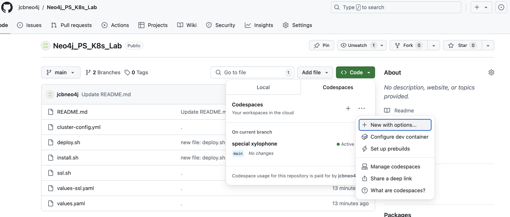
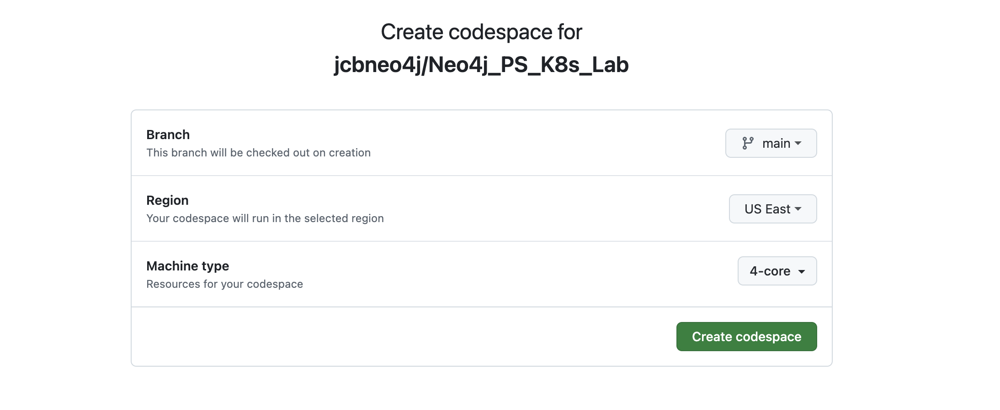
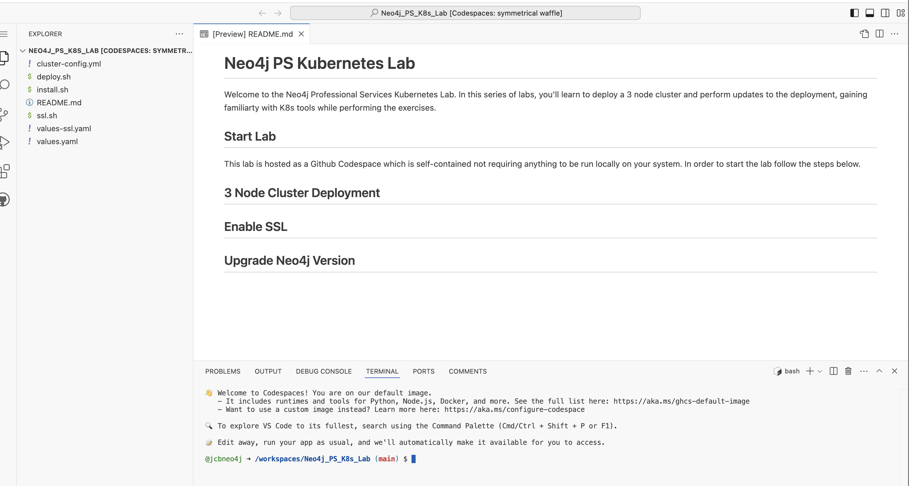

# Neo4j PS Kubernetes Lab

Welcome to the Neo4j Professional Services Kubernetes Lab. In this series of labs, you'll learn to deploy a 3 node cluster and perform updates to the deployment, gaining familiarty with K8s tools while performing the exercises.

## Start Lab

This lab is hosted as a Github Codespace which is self-contained not requiring anything to be run locally on your system. In order to start the lab follow the steps below. 

From the project page of this repository, click on the Code button, select the Codespaces tab, click the ellipsis (...), and select New with options... from the menu:




In the next page, select the Branch, Region, and Machine type as shown in the below image and then click the Create codespace button:




After a few moments, the Codespace will open up in an online VS Code IDE, as shown:




## 3 Node Cluster Deployment

The first step in deploying a Neo4j cluster is to provision the Kubernetes (K8s) nodes via k3d, which is a lightweight K8s package to manage K8s environments. This can done running the following in the terminal. The script will download and install the k3d and configure a 3 node cluster:

```bash
./install.sh
```

Next, is to configure helm to point to the Neo4J Helm repo by running the following commands:
```bash
helm repo add neo4j https://helm.neo4j.com/neo4j
helm repo update
```

Prior to deploying Neo4j a K8s namespace needs to be created by running the following command to create and set the context of the namespace (named neo4j to your current context in kubectl:

```bash
kubectl create namespace neo4j
kubectl config set-context --current --namespace=neo4j
```

Now the cluster can be deployed via helm commands below. These will create a separate "release" for each node in the 3 node cluster. Each node release (e..g deployment) will follow a naming convention of "server-1, server-2, etc":

```bash
helm install server-1 neo4j/neo4j --namespace neo4j -f values.yaml
helm install server-2 neo4j/neo4j --namespace neo4j -f values.yaml
helm install server-3 neo4j/neo4j --namespace neo4j -f values.yaml
```

A few minutes after the deployment you can validate it's running by issuing the following command:

```bash
kubectl get pods
```

Once all of the nodes have a STATUS of 'Running' and are READY with 1/1, you can proceed:

```bash
NAME         READY   STATUS    RESTARTS   AGE
server-1-0   1/1     Running   0          10m
server-2-0   1/1     Running   0          10m
server-3-0   1/1     Running   0          10m
```

## Enable SSL


## Upgrade Neo4j Version


